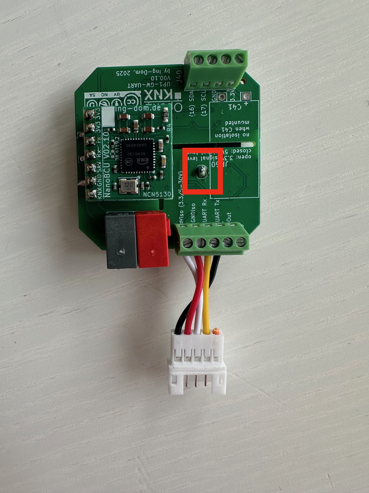

# Toshiba

## OpenKNX UP1-GW-UART

- Anschluss wie im Bild dargestellt. 
- JP60 via Lötbrücke schließen

**ACHTUNG: mein vorkonfektioniere Buchse hat ein rotes Kabel auf GND, daher von der Farbe nicht irritieren lassen, wichtig ist die Reihenfolge der Drähte zur Buchse**
